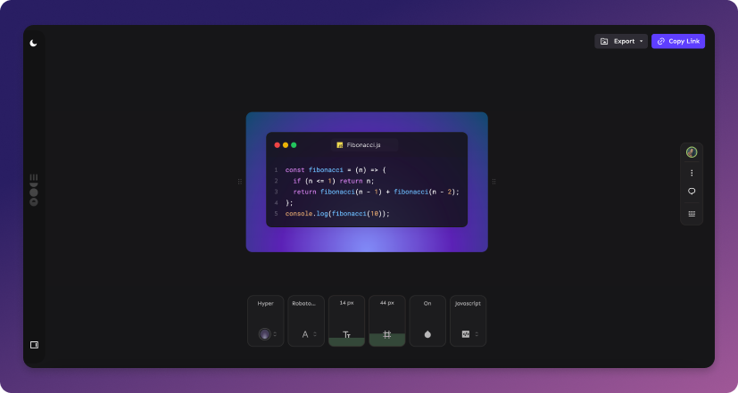

## JollyCode

Welcome to the Github repo for JollyCode. An open-source aesthetically appealing code beautifier. With features tailored for developers, a tool that serves as a hub for code beautification, sharing, and collaborative learning.

## Featured Tools

### ✨ Multi-Language Support

We support a wide array of programming languages, including Python, JavaScript, Java, C++, C#, Ruby, PHP, and more. No matter your preferred development language, we've got you covered.

### 🎨 Share Code Imagery

Fancy showing off your beautiful code? You can share captivating images of your code right from JollyCode.

### 🌍 Short shared URL

Once you share your URL, it gets shortened for easy sharing via services like Twitter, Facebook, LinkedIn, etc.

### 👥 Shared URL visitors count

On the shared link, visualize the users interacting with your code snippet.

### 💾 Code Snippets

Save your code snippets for future reference directly in the tool. Group your saved snippets into categories for easy retrieval.

- **Saving Snippets**: Use the 'Save Snippet' button after you've added your code. Give your snippet a meaningful name so you can easily find it later.

- **Organizing Snippets**: Group your snippets into categories or use tags to organize them. This organization method makes it easy to find a relevant piece of code.

- **Using Snippets**: Click on any snippet in 'My Snippets' to load it into the code editor. You can then modify it as per your current requirements.

## 🚀 Built With

- NextJS
- Zustand
- Supabase
- TailwindCSS

## Environment Variables

We validate configuration with `@t3-oss/env-nextjs`; `pnpm env:check` runs automatically before `pnpm dev`, `pnpm build`, and `pnpm start`. Copy `.env.example` to `.env.local` and fill in the required values.

**Required**
- Supabase access: `NEXT_PUBLIC_SUPABASE_URL`, `NEXT_PUBLIC_SUPABASE_ANON_KEY`, `SUPABASE_SERVICE_ROLE_KEY`
- Liveblocks auth: `LIVEBLOCKS_SECRET_KEY`
- Stripe billing: `NEXT_PUBLIC_STRIPE_PUBLISHABLE_KEY`, `STRIPE_SECRET_KEY`, `STRIPE_WEBHOOK_SECRET`, `NEXT_PUBLIC_STRIPE_STARTED_MONTHLY_PRICE_ID`, `NEXT_PUBLIC_STRIPE_STARTED_YEARLY_PRICE_ID`, `NEXT_PUBLIC_STRIPE_PRO_MONTHLY_PRICE_ID`, `NEXT_PUBLIC_STRIPE_PRO_YEARLY_PRICE_ID`
- App domains: `NEXT_PUBLIC_APP_URL`, `NEXT_PUBLIC_VERCEL_ENV`, `NEXT_PUBLIC_VERCEL_URL`

**Optional**
- Observability: `SENTRY_DSN`, `SENTRY_ENVIRONMENT`, `SENTRY_TRACES_SAMPLE_RATE`, `SENTRY_PROFILES_SAMPLE_RATE`, `SENTRY_TRACE_PROPAGATION_TARGETS`, `SENTRY_RELEASE`, `SENTRY_REPLAYS_SESSION_SAMPLE_RATE`, `SENTRY_REPLAYS_ON_ERROR_SAMPLE_RATE`, `NEXT_PUBLIC_SENTRY_TUNNEL`
- Analytics/marketing: `NEXT_PUBLIC_POSTHOG_KEY`, `NEXT_PUBLIC_POSTHOG_HOST`, `NEXT_PUBLIC_POSTHOG_ENABLE_LOCAL`, `POSTHOG_API_KEY`, `NEXT_PUBLIC_HOTJAR_SITE_ID`, `NEXT_PUBLIC_SITE_URL`, `CANNY_API_KEY`
- Feature flags & experiments: `NEXT_PUBLIC_EXPORT_EXPERIMENT`, `NEXT_PUBLIC_TRANSITION_EXPERIMENT`
- Security & rate limiting: `ARCJET_KEY`, `CORS_ALLOWED_ORIGIN`, `NEXT_PUBLIC_LIVEBLOCKS_PUBLIC_API_KEY`, `NEXT_PUBLIC_VERCEL_GIT_COMMIT_SHA`, `VERCEL_GIT_COMMIT_SHA`
- Maintenance helpers: `KEEPALIVE_ENDPOINT`, `KEEPALIVE_API_KEY`, `SKIP_ENV_VALIDATION`

## Roadmap

For any additional feature request 👉: [Check it out](https://jollycode.canny.io/feature-requests)

Discuss future changes and features that will be implemented.

---

Made with ♥ by Dana Rocha 👋 [Get in touch!](https://bento.me/danarocha)
